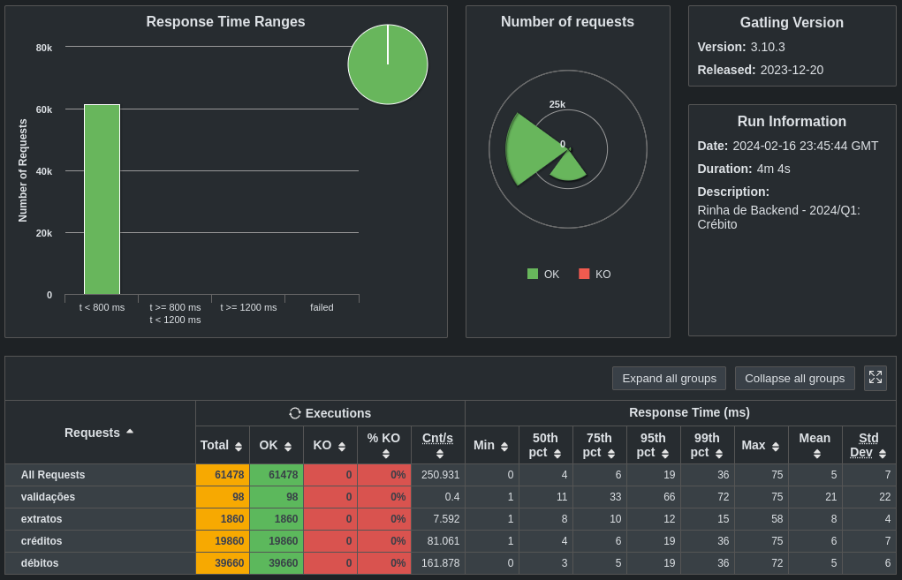

<h1 align="center">Submissão para Rinha de Backend - Controle de Concorrência</h1>

> **O repositório do evento está disponível [aqui](https://github.com/AlcivanLucas/rinha-de-backend-2024-q1).**

- [**Node**](https://golang.org): Node.js
- [**pgx**](https://github.com/jackc/pgx): PostgreSQL driver and toolkit
- [**PostgreSQL**](https://www.postgresql.org): Banco de dados relacional
- [**nginx**](https://nginx.org): Servidor HTTP e proxy reverso
- [**Pg Driver**](https://www.npmjs.com/package/pg):PG driver native 
- [**Zod Validation**](https://zod.dev/): Zod for Validation

  


## Alcivan Lucas

## Sobre o Projeto 
O desafio consiste em desenvolver uma API HTTP com endpoints específicos para lidar com transações e extratos de clientes. As transações incluem créditos e débitos, e a API deve garantir consistência nos saldos dos clientes (Concorrência).


## Instruções

Só rodar o comando abaixo:

```sh
$ docker-compose up
```

## Resultados





- Instagram: [@alcivan_lucas](https://www.instagram.com/alcivan_lucas/)
- Github: [@Alcivan_lucas](https://github.com/AlcivanLucas)
- LinkedIn: [Alcivan Lucas](https://www.linkedin.com/in/alcivan-lucas)
